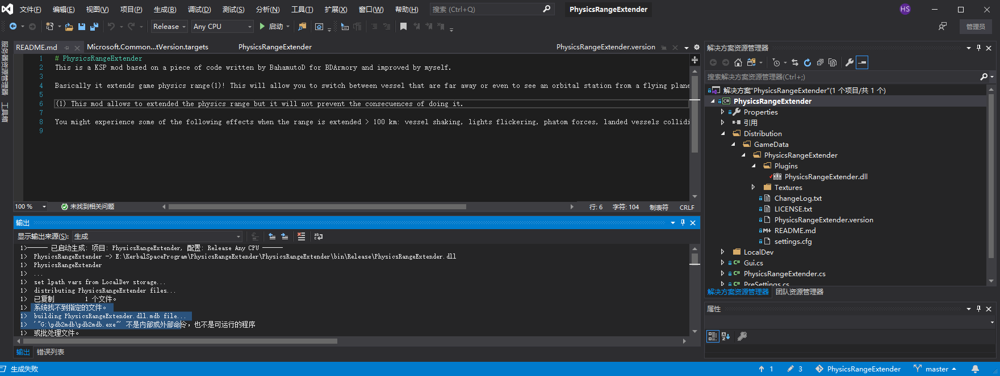

# PhysicsRangeExtender
This is a KSP mod based on a piece of code written by BahamutoD for BDArmory and improved by myself. 

Basically it extends game physics range(1)! This will allow you to switch between vessel that are far away or even to see an orbital station from a flying plane.

(1) This mod allows to extended the physics range but it will not prevent the consecuences of doing it. 

You might experience some of the following effects when the range is extended > 100 km: vessel shaking, lights flickering, phatom forces, landed vessels colliding with the ground, etc.

---

小咩的补充:

编译操作:

- 装vs2019
- 双击PhysicsRangeExtender\PhysicsRangeExtender\PhysicsRangeExtender.sln打开
  - 可能提示缺.net库 会弹出链接 在弹出的链接里下载对应版本的库 一路next安装即可
- 

右边我选中(标蓝)的那一行字上右键点属性 左面就会弹出如图界面

"文件夹处填ksp安装路径下的KSP_x64_Data\Managed\文件夹 然后点添加文件夹

最上面debug改成release 然后按f7编译

会报错pdb2mdb啥啥找不着 不用管 已经编译成功了

然后

PhysicsRangeExtender\Distribution文件夹里东西贴进KSP的gamedata文件夹就可以用了